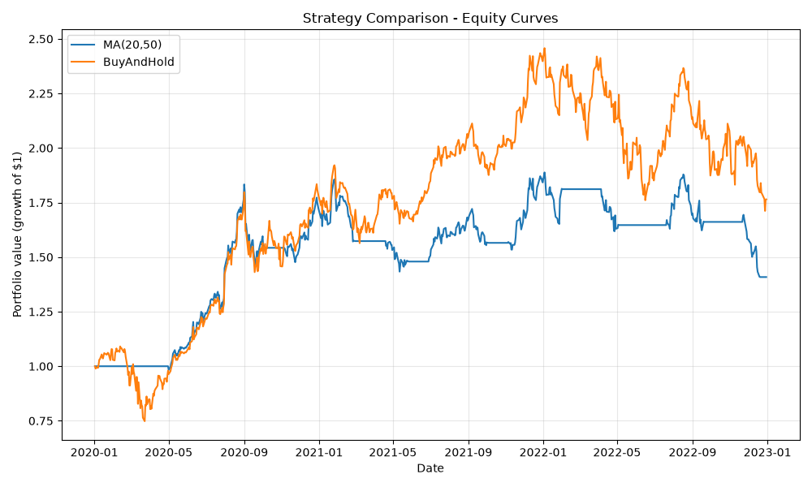

# QuantLab


A configurable backtesting and strategy research platform for evaluating trading strategies against historical market data. Built around a pluggable strategy interface and a no-lookahead backtest engine, with risk-adjusted performance metrics. The engine enforces no-lookahead bias by construction, and walk-forward validation guards against overfitting.



## Features

- [x] Historical price data fetching with local caching
- [x] Pluggable strategy interface
- [x] Event-driven backtest engine with transaction costs
- [x] Performance metrics (Sharpe, max drawdown, CAGR, win rate)
- [x] Walk-forward validation
- [x] YAML-configured experiment runs
- [x] Strategy comparison reports and equity curve charts

## Example

Comparing a moving-average crossover against buy-and-hold on AAPL (2020–2022):

| Strategy    | Total Return | Sharpe | Max Drawdown |
|-------------|-------------|--------|--------------|
| MA(20,50)   | +40.9%      | 0.61   | -25.4%       |
| Buy & Hold  | +76.4%      | 0.70   | -31.4%       |

Buy-and-hold earned more, but at higher risk — nearly identical Sharpe ratios
show the extra return was mostly compensation for volatility, not skill.

## Installation

```bash
git clone https://github.com/susanyoon/quantlab.git
cd quantlab
pip install -e ".[dev]"
```

## Usage

Define an experiment in a YAML file:

```yaml
ticker: AAPL
start: "2020-01-01"
end: "2023-01-01"
strategy: moving_average
params:
  short_window: 20
  long_window: 50
```

Run a single backtest:

```bash
quantlab run configs/ma_apple.yaml
```

Or compare all strategies & generate the equity-curve chart:

```bash
quantlab compare configs/ma_apple.yaml
```

## Tech Stack
- Python
- pandas
- NumPy
- yfinance
- matplotlib
- Typer 
- PyYAML 
- pytest 
- ruff

## Running Tests

```bash
pytest
```

## Project Status
v1.0.0 released.